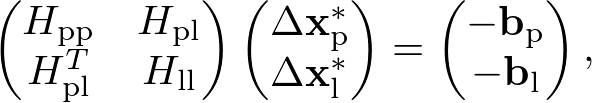
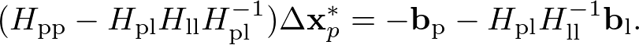
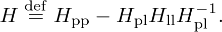
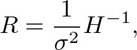

# ORB SLAM2 with pose uncertainty

We extended [orbslam-map-saving-extension](https://github.com/TUMFTM/orbslam-map-saving-extension) to publish the estimated pose with uncertainty represented by the covariance matrix. In below, we describe important parts of this package. See [orbslam-map-saving-extension](https://github.com/TUMFTM/orbslam-map-saving-extension) for more details such as installation and dependencies.

# Determination of uncertainty

In the camera pose tracking process of ORB SLAM2, [g2o](https://github.com/RainerKuemmerle/g2o) is used to solve the graph optimization problem. In the [g2o paper](https://www.researchgate.net/publication/224252449_G2o_A_general_framework_for_graph_optimization), the linear system for the optimization is introduced in equation (24)

where subscripts ${\rm p}$ and ${\rm l}$ represent pose and landmark, $H$ is Hessian, $\Delta {\bf x}^{*}$ is the increment, and ${\bf b}$ is the gradient. Hessian regarding the pose increment ${\bf x}_{\rm p}^{*}$ is formed by taking the Schur complement as

This is equation (25) of the g2o paper. Here, we define $H$ as

Then, we determine the uncertainty, i.e., covariance matrix, of the estimate by ORB SLAM2 as

where $\sigma^{2}$ is the scale factor and is must be positive.

# Parameters

In the orb_slam2_ros/launch/ directory, we prepare two launch scripts, **bebop_localization.launch** and **bebop_slam.launch**. Followings are the important parameters in these launch scripts.

**pose_covariance_scale_factor** (type: double)

The scale factor for the pose covariance matrix, $\sigma^{2}$.

**use_static_covariance_matrix** (type: bool)

If it is true, the uncertainty determination described above is used. If not, diagonal constant covariance matrix will be set.

**static_covariance_matrix_value** (type: double)

If use_static_covariance_matrix is false, this value will be set to the pose covariance.

These launch scripts load yaml files located at orb_slam2_ros/settings/. You can change parameters related to ORB SLAM2 such as name of a map by editing the yaml files.

